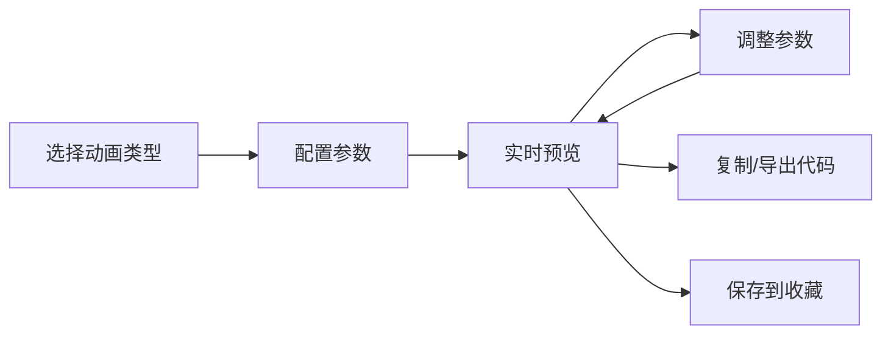

## 1. 产品概述
CSS动画可视化生成工具是一款面向前端开发者的在线工具，通过可视化界面快速创建、预览和导出CSS动画效果，降低动画开发门槛，提升开发效率。

## 2. 核心功能

### 2.1 功能模块
1. **配置面板**：预设动画选择、自定义关键帧、动画参数配置
2. **预览区域**：实时动画预览、交互控制
3. **代码生成**：实时CSS代码输出、一键复制、导出文件
4. **收藏管理**：动画收藏夹、localStorage持久化
5. **动画序列**：多动画组合、触发时机配置
6. **模板库**：常用动画模板、场景预设

### 2.2 页面详情
| 页面名称 | 模块名称 | 功能描述 |
|-----------|-------------|---------------------|
| 主页面 | 配置面板 | 预设动画选择（淡入淡出、滑动、缩放、旋转、弹跳、摇晃）、自定义关键帧编辑器、动画参数配置（持续时间、延迟、缓动函数、循环次数、方向、填充模式） |
| 主页面 | 预览区域 | 可交互元素展示、播放/暂停控制、实时预览动画效果 |
| 主页面 | 代码生成区 | 实时生成CSS代码、@keyframes定义、一键复制、导出CSS文件 |
| 主页面 | 收藏夹 | 保存动画配置、加载收藏动画、删除收藏 |
| 主页面 | 动画序列 | 添加多个动画、配置触发时机、预览动画链效果 |
| 主页面 | 模板库 | 加载触发、悬浮触发、点击触发、滚动触发等场景预设 |

## 3. 核心流程
用户选择动画类型→配置动画参数→实时预览效果→复制/导出CSS代码→保存到收藏夹

## 4. 用户界面设计

### 4.1 设计风格
- **主色调**：深蓝色系 #1e3a8a（专业、科技感）
- **辅助色**：青绿色 #10b981（活力、创意）
- **按钮风格**：圆角渐变按钮，带微悬浮效果
- **字体**：Inter（现代简洁），标题18-24px，正文14px
- **布局**：三栏式布局，左侧配置、中间预览、右侧代码
- **图标风格**：线性图标，简洁统一

### 4.2 页面设计概述
| 页面名称 | 模块名称 | UI元素 |
|-----------|-------------|-------------|
| 主页面 | 配置面板 | 卡片式分组、滑块控件、下拉选择器、颜色选择器 |
| 主页面 | 预览区域 | 居中展示框、播放控制按钮、元素缩放交互 |
| 主页面 | 代码生成区 | 语法高亮代码块、复制按钮、导出按钮 |
| 主页面 | 模板库 | 网格布局卡片、hover预览效果 |

### 4.3 响应式
- Desktop-first设计，三栏布局
- 平板端：左右栏折叠为可切换面板
- 移动端：上下堆叠布局
