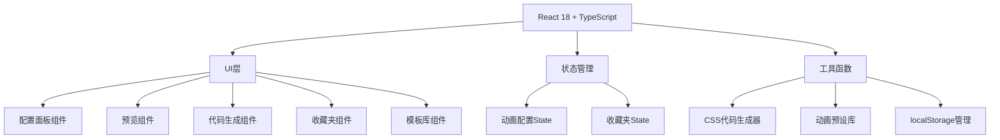

## 1. 架构设计



## 2. 技术描述
- **前端**：React@18 + TypeScript + Vite
- **样式**：TailwindCSS@3
- **代码高亮**：prismjs
- **图标**：lucide-react
- **状态管理**：React useState/useReducer
- **存储**：localStorage

## 3. 核心目录结构

```
src/
├── components/
│   ├── ConfigPanel/      # 配置面板
│   ├── PreviewArea/      # 预览区域
│   ├── CodeOutput/       # 代码输出
│   ├── Favorites/        # 收藏夹
│   ├── AnimationSequence/# 动画序列
│   └── TemplateLibrary/  # 模板库
├── hooks/
│   └── useAnimation.ts   # 动画状态管理
├── utils/
│   ├── cssGenerator.ts   # CSS代码生成
│   ├── presets.ts        # 动画预设
│   └── storage.ts        # 存储工具
├── types/
│   └── animation.ts      # 类型定义
└── App.tsx
```

## 4. 类型定义

```typescript
interface AnimationConfig {
  id: string;
  name: string;
  type: 'fade' | 'slide' | 'scale' | 'rotate' | 'bounce' | 'shake' | 'custom';
  duration: number;
  delay: number;
  easing: string;
  iterationCount: number | 'infinite';
  direction: 'normal' | 'reverse' | 'alternate' | 'alternate-reverse';
  fillMode: 'none' | 'forwards' | 'backwards' | 'both';
  keyframes: Keyframe[];
}

interface Keyframe {
  offset: number;
  properties: Record<string, string>;
}

interface AnimationSequenceItem {
  animationId: string;
  trigger: 'immediate' | 'delay' | 'click' | 'hover';
  triggerDelay?: number;
}

interface Favorite {
  id: string;
  name: string;
  config: AnimationConfig;
  createdAt: number;
}
```

## 5. 动画预设定义

| 类型 | 关键帧定义 |
|------|-----------|
| fadeIn | 0%: opacity 0 → 100%: opacity 1 |
| fadeOut | 0%: opacity 1 → 100%: opacity 0 |
| slideInLeft | 0%: transform translateX(-100%) → 100%: translateX(0) |
| slideInRight | 0%: transform translateX(100%) → 100%: translateX(0) |
| scaleIn | 0%: transform scale(0) → 100%: scale(1) |
| rotate | 0%: rotate(0deg) → 100%: rotate(360deg) |
| bounce | 0%,20%,50%,80%,100%: translateY(0) → 40%: translateY(-30px) → 60%: translateY(-15px) |
| shake | 0%,100%: translateX(0) → 10%,30%,50%,70%,90%: translateX(-10px) → 20%,40%,60%,80%: translateX(10px) |
